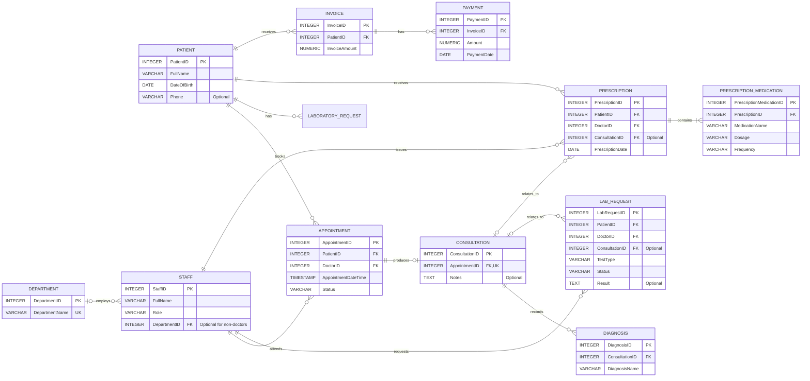

# MeriCare specialist hospital management system (simulated) ER Diagram

```mermaid
erDiagram
	direction LR
	PATIENT {
		INTEGER PatientID PK ""  
		VARCHAR FullName  ""  
		DATE DateOfBirth  ""  
		VARCHAR Phone  "Optional"  
	}

	DEPARTMENT {
		INTEGER DepartmentID PK ""  
		VARCHAR DepartmentName UK ""  
	}

	STAFF {
		INTEGER StaffID PK ""  
		VARCHAR FullName  ""  
		VARCHAR Role  ""  
		INTEGER DepartmentID FK "Optional for non-doctors"  
	}

	APPOINTMENT {
		INTEGER AppointmentID PK ""  
		INTEGER PatientID FK ""  
		INTEGER DoctorID FK ""  
		TIMESTAMP AppointmentDateTime  ""  
		VARCHAR Status  ""  
	}

	CONSULTATION {
		INTEGER ConsultationID PK ""  
		INTEGER AppointmentID FK,UK ""  
		TEXT Notes  "Optional"  
	}

	DIAGNOSIS {
		INTEGER DiagnosisID PK ""  
		INTEGER ConsultationID FK ""  
		VARCHAR DiagnosisName  ""  
	}

	LAB_REQUEST {
		INTEGER LabRequestID PK ""  
		INTEGER PatientID FK ""  
		INTEGER DoctorID FK ""  
		INTEGER ConsultationID FK "Optional"  
		VARCHAR TestType  ""  
		VARCHAR Status  ""  
		TEXT Result  "Optional"  
	}

	PRESCRIPTION {
		INTEGER PrescriptionID PK ""  
		INTEGER PatientID FK ""  
		INTEGER DoctorID FK ""  
		INTEGER ConsultationID FK "Optional"  
		DATE PrescriptionDate  ""  
	}

	PRESCRIPTION_MEDICATION {
		INTEGER PrescriptionMedicationID PK ""  
		INTEGER PrescriptionID FK ""  
		VARCHAR MedicationName  ""  
		VARCHAR Dosage  ""  
		VARCHAR Frequency  ""  
	}

	INVOICE {
		INTEGER InvoiceID PK ""  
		INTEGER PatientID FK ""  
		NUMERIC InvoiceAmount  ""  
	}

	PAYMENT {
		INTEGER PaymentID PK ""  
		INTEGER InvoiceID FK ""  
		NUMERIC Amount  ""  
		DATE PaymentDate  ""  
	}

	PATIENT||--o{APPOINTMENT:"books"
	STAFF||--o{APPOINTMENT:"attends"
	DEPARTMENT|o--o{STAFF:"employs"
	APPOINTMENT||--o|CONSULTATION:"produces"
	CONSULTATION||--o{DIAGNOSIS:"records"
	PATIENT||--o{LABORATORY_REQUEST:"has"
	STAFF||--o{LAB_REQUEST:"requests"
	CONSULTATION|o--o{LAB_REQUEST:"relates_to"
	PATIENT||--o{PRESCRIPTION:"receives"
	STAFF||--o{PRESCRIPTION:"issues"
	CONSULTATION|o--o{PRESCRIPTION:"relates_to"
	PRESCRIPTION ||--|{ PRESCRIPTION_MEDICATION : contains
	PATIENT||--o{INVOICE:"receives"
	INVOICE||--o{PAYMENT:"has"
```